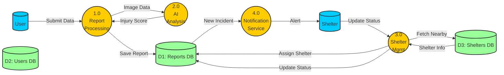
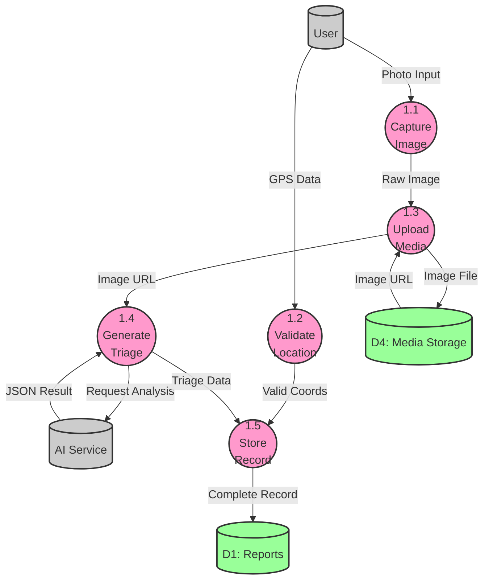

# DATA FLOW DIAGRAMS (DFD)
# ANIMAL SHELTER HELPLINE

This document contains the Data Flow Diagrams (DFD) for the Animal Shelter Helpline system, ranging from the high-level context (Level 0) to detailed process breakdowns (Level 2).

---

## LEVEL 0 DFD (CONTEXT DIAGRAM)

The Context Diagram represents the entire system as a single process interacting with external entities.

```mermaid
graph TD
    %% Entities
    User[("User / Reporter")]
    Shelter[("Shelter / Rescuer")]
    Admin[("System Admin")]

    %% Main System
    System((("Animal Shelter<br/>Helpline System")))

    %% Flows
    User -->|1. Submit Report (Image, Loc)| System
    System -->|2. First Aid Advice| User

    System -->|3. Emergency Notification| Shelter
    Shelter -->|4. Update Rescue Status| System

    Admin -->|5. Manage Shelters| System
    System -->|6. Analytics Dashboard| Admin

    %% Styling
    style System fill:#ff9900,stroke:#333,stroke-width:4px,color:white
    style User fill:#00ccff,stroke:#333,stroke-width:2px
    style Shelter fill:#00ccff,stroke:#333,stroke-width:2px
    style Admin fill:#00ccff,stroke:#333,stroke-width:2px
```

---

## LEVEL 1 DFD (SYSTEM OVERVIEW)

This diagram breaks down the main system into its major sub-processes and data stores.



---

## LEVEL 2 DFD (DETAILED REPORT PROCESSING)

This diagram expands **Process 1.0 (Report Processing)** to show the detailed steps involved in handling a user report.


