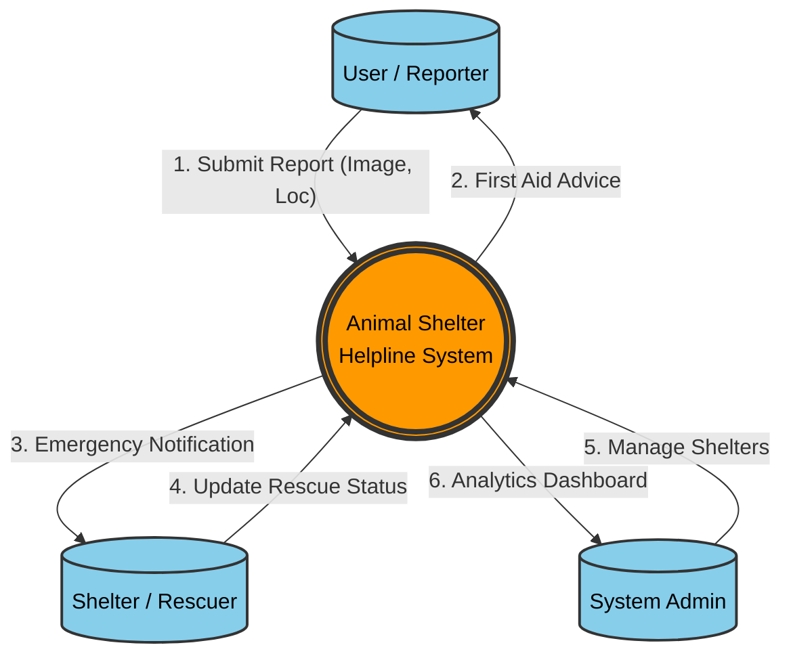
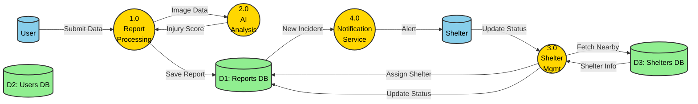

# DATA FLOW DIAGRAMS (DFD)
# ANIMAL SHELTER HELPLINE

This document contains the Data Flow Diagrams (DFD) for the Animal Shelter Helpline system, ranging from the high-level context (Level 0) to detailed process breakdowns (Level 2).

---

## LEVEL 0 DFD (CONTEXT DIAGRAM)

The Context Diagram represents the entire system as a single process interacting with external entities.

---

## LEVEL 1 DFD (SYSTEM OVERVIEW)

This diagram breaks down the main system into its major sub-processes and data stores.

---

## LEVEL 2 DFD (DETAILED REPORT PROCESSING)

This diagram expands **Process 1.0 (Report Processing)** to show the detailed steps involved in handling a user report.

