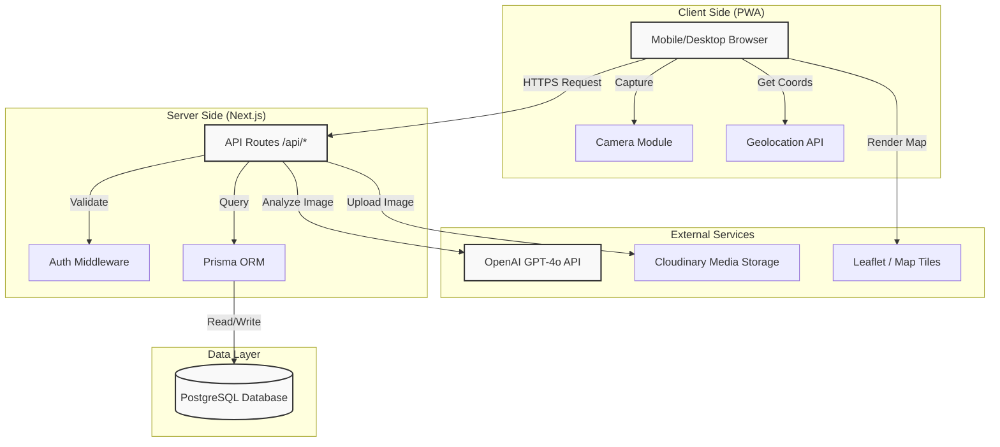
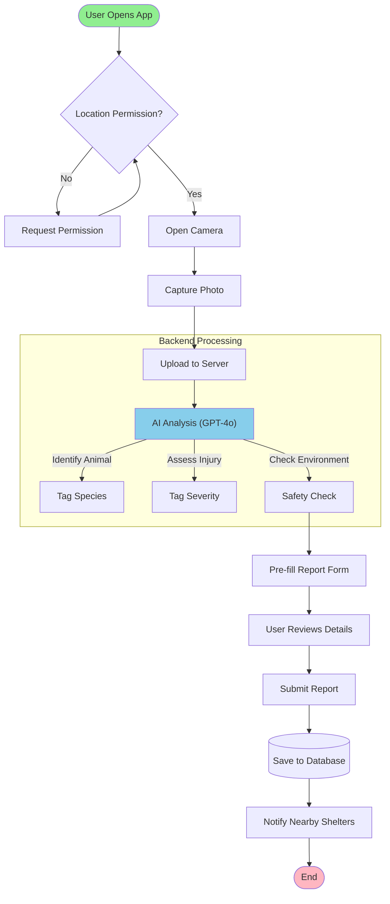
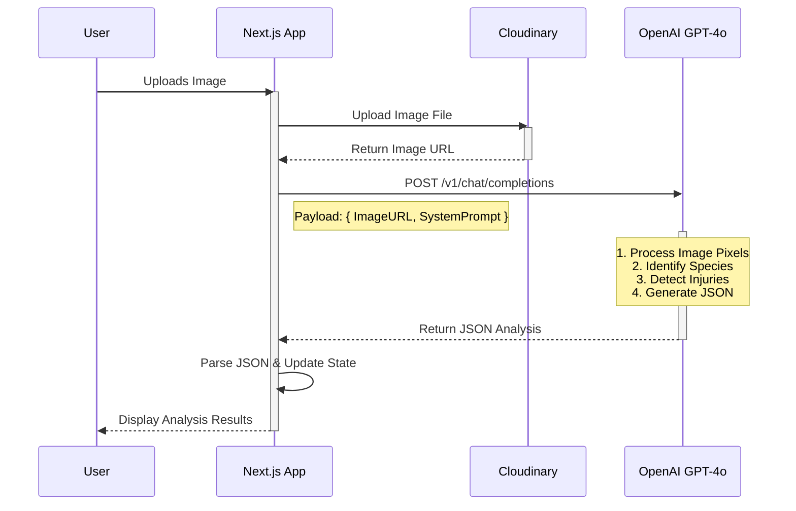
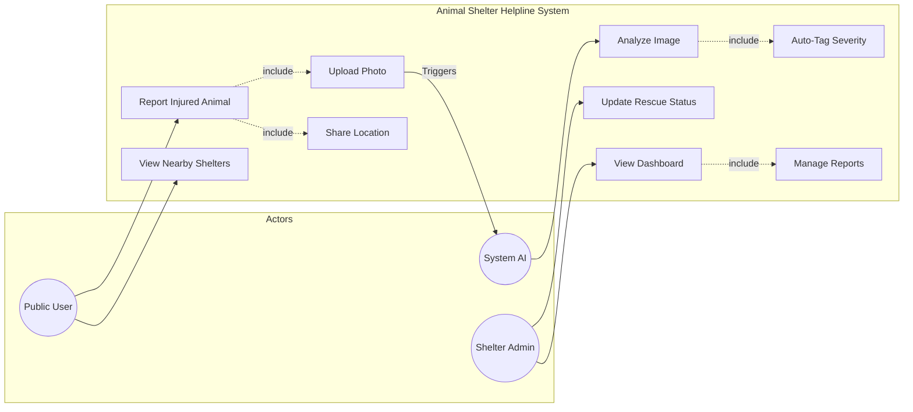
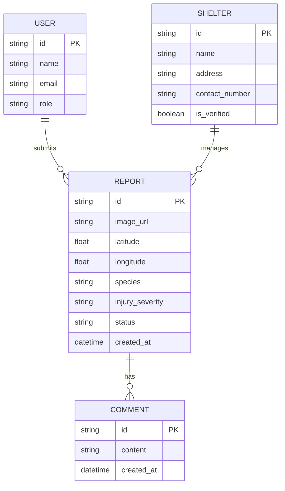

# PROJECT DIAGRAMS
# ANIMAL SHELTER HELPLINE

This document contains visual diagrams representing the architecture, workflow, and logic of the Animal Shelter Helpline system. These diagrams are written in **Mermaid.js** syntax, which renders as images in most modern markdown viewers (like GitHub, VS Code, Obsidian).

---

## 1. SYSTEM ARCHITECTURE DIAGRAM

This diagram shows the high-level structure of the application, including the client, server, database, and external integrations.

---

## 2. COMPLETE WORKFLOW FLOWCHART

This flowchart illustrates the step-by-step journey of a user reporting an injured animal.

---

## 3. AI PROCESSING SEQUENCE DIAGRAM

This diagram details the specific interaction between the System and the GPT-4o Model.

---

## 4. USE CASE DIAGRAM

This diagram identifies the actors and their interactions with the system.

---

## 5. DATABASE ENTITY-RELATIONSHIP (ER) DIAGRAM

This diagram shows the data structure and relationships.

